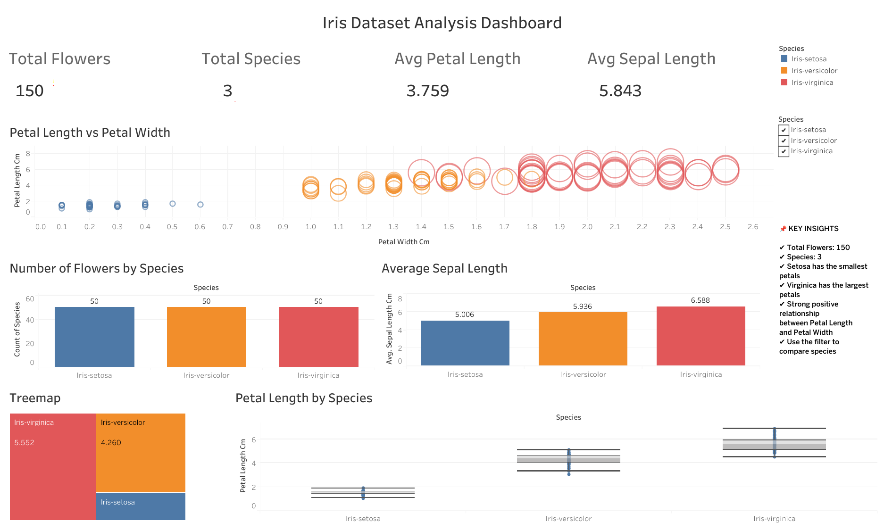
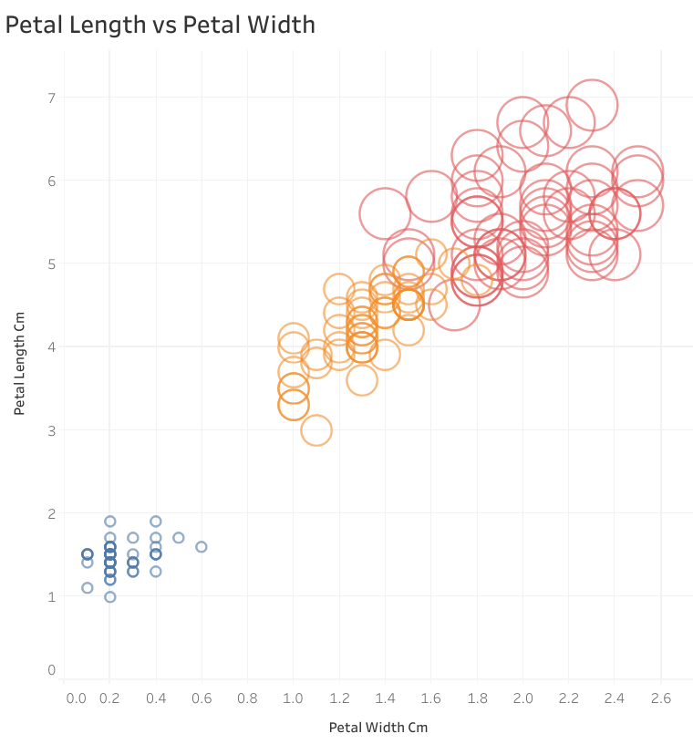
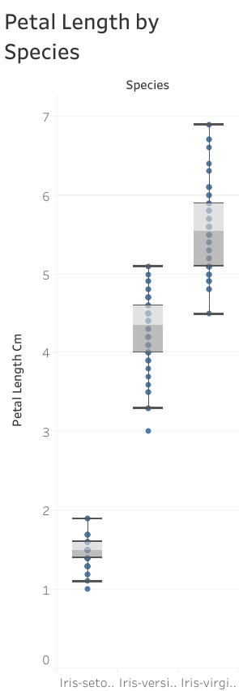
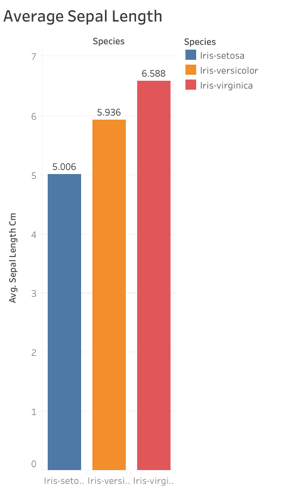
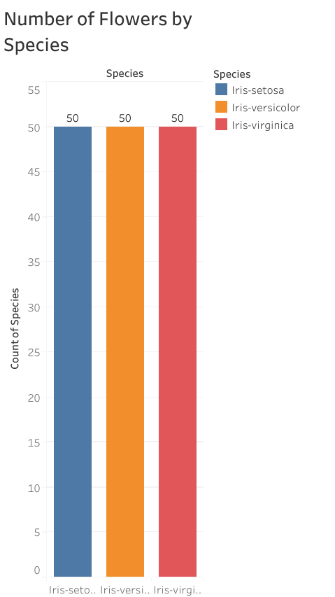

# Data Visualization using Tableau

##  Project Overview

This project was completed as part of the **CodeAlpha Data Analytics Internship**.

The objective of this task is to transform raw data into meaningful visualizations using **Tableau Public**. The dashboard provides insights into the famous Iris Flower Dataset through interactive charts and filters, enabling better understanding of relationships, distributions, and comparisons among different Iris species.

---

##  Live Interactive Dashboard

**View the Interactive Dashboard:**

https://public.tableau.com/app/profile/yuvedha.dhandapani/viz/CodeAlpha_Task3_Iris_Dashboard/PetalLengthvsPetalWidth

## 📷 Dashboard Preview

---

##  Objectives

- Convert raw data into meaningful visualizations
- Create interactive dashboards using Tableau
- Analyze patterns and trends in the dataset
- Present insights in an easy-to-understand format
- Build a professional data visualization portfolio project

---

##  Dataset

**Dataset:** Iris Dataset

The Iris dataset contains measurements of iris flowers from three different species.

### Features

- Sepal Length
- Sepal Width
- Petal Length
- Petal Width
- Species

Total Records: **150**

Species:
- Setosa
- Versicolor
- Virginica

---

##  Tools Used

- Tableau Public 2026.2
- Microsoft Excel (Dataset Verification)
- Git & GitHub 

---

#  Visualizations Created

###  Species Distribution
Shows the number of flowers belonging to each species.

---

###  Scatter Plot
Petal Length vs Petal Width colored by Species.

Purpose:
- Understand correlation
- Identify clusters
- Compare species

---

###  Box Plot
Displays the distribution of Petal Length for each species.

Purpose:
- Detect spread
- Compare medians
- Identify outliers

---

###  Treemap
Represents the average Petal Length of each species.

Purpose:
- Compare average measurements visually

---

###  Bar Chart
Average Sepal Width by Species.

Purpose:
- Compare average Sepal Width among species.

---

###  KPI Cards
Dashboard KPIs showing:

- Total Flowers
- Number of Species

---

#  Interactive Dashboard

The dashboard combines all visualizations into a single interactive view.

Features include:

- Species Filter
- Interactive Dashboard
- Dynamic Chart Updates
- Dashboard KPIs
- Visual Insights

---

#  Key Insights

- The dataset contains **150 flower samples**.
- There are **3 different Iris species**.
- **Setosa** has the smallest petal dimensions.
- **Virginica** has the largest petal dimensions.
- Petal Length and Petal Width show a strong positive relationship.
- Species can be clearly distinguished using petal measurements.

---

#  Dashboard Preview

## Dashboard

---

## Scatter Plot For Petal Length vs Petal Width

---

## Box Plot For Petal Length by Species 

---

## Bar Chart For Average Sepal Length

---

## Treemap

---

## Bar Chart For Number of Flowers by Species

---

#  Project Demo

A complete demonstration video is available in the repository.

https://drive.google.com/file/d/19fG7TVhv_N2GeDPVC0CbhH1k-5eEVU-J/view?usp=sharing

---

#  How to View the Project

## Option 1

View the exported dashboard images located inside:

images/

---

## Option 2

Watch the demonstration video:

(https://drive.google.com/file/d/19fG7TVhv_N2GeDPVC0CbhH1k-5eEVU-J/view?usp=sharing)

---

#  Acknowledgements

- CodeAlpha
- Tableau Public
- Iris Dataset

---

#  Author

**Yuvedha Dhandapani**

Data Analytics Intern — CodeAlpha

---

## ⭐ If you found this project useful, consider giving it a star on GitHub!